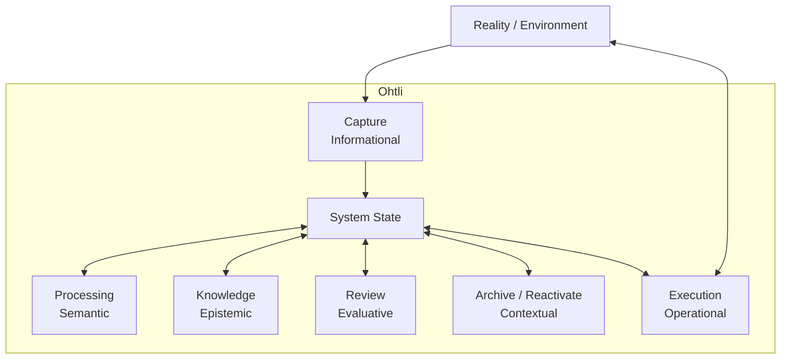
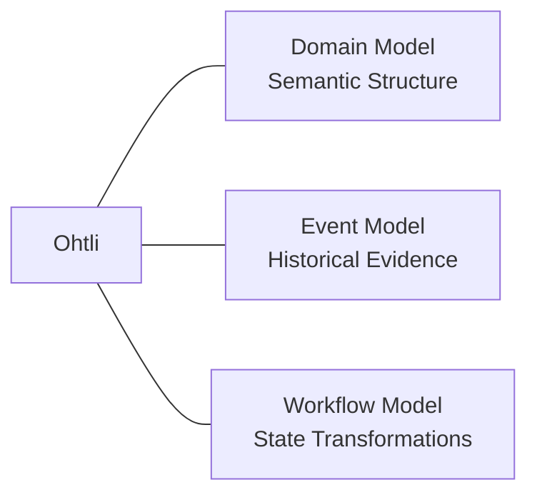

# Workflow Model

## Purpose

The Ohtli Workflow Model defines the transformations through which
information, domain state, operational results, understanding,
evaluations, and contextual presence evolve within the system.

It answers:

> How does relevant state transform in Ohtli?

The Workflow Model consists of six core workflows:

- Capture;
- Processing;
- Execution;
- Knowledge;
- Review;
- Archive.

These workflows do not form a pipeline.

They represent distinct classes of transformation that become applicable
according to system state and relevant context.

The Workflow Model defines transformation semantics and boundaries.

It does not define:

- workflow orchestration;
- workflow engines;
- user interfaces;
- filesystem organization;
- database schemas;
- agent architecture;
- automation policies;
- authorization policies;
- implementation-specific execution mechanisms.

---

# Core Model

The Workflow Model is organized around System State.

System State acts as the coordination medium through which workflow
applicability emerges and workflow results become relevant to subsequent
transformations.

Conceptually:

Relevant System State / Context

↓

Workflow Preconditions Satisfied

↓

Workflow Applicable

↓

if executed

↓

Transformation

↓

Updated System State

↓

New Workflow Applicability

A workflow does not directly invoke another workflow.

Instead, a workflow transformation may change system state in a way that
makes one or more other workflows applicable.

---

# Canonical Architecture



The diagram represents workflows around System State rather than as a
sequence.

Arrows between workflows and System State represent participation in
state-based transformation.

They do not represent direct component calls or mandatory execution
order.

There are intentionally no direct workflow-to-workflow edges.

---

# Core Workflows

| Workflow | Transformation | Central Question |
| --- | --- | --- |
| Capture | Informational | What should be preserved? |
| Processing | Semantic | What does this mean? |
| Execution | Operational | What work changes the state? |
| Knowledge | Epistemic | What can be understood? |
| Review | Evaluative | What requires attention? |
| Archive | Contextual | What should remain preserved but no longer operationally present? |

A compact conceptual summary is:

> Capture preserves.
>
> Processing determines meaning.
>
> Execution acts.
>
> Knowledge develops understanding.
>
> Review evaluates significance.
>
> Archive changes contextual presence while preserving history.

---

# System State

System State is an architectural abstraction representing the relevant
observable condition of Ohtli at a given time.

It is not a Domain Object and does not imply a concrete implementation
such as a `SystemState` class, database table, or persisted aggregate.

System State may conceptually include:

- Persistent Information;
- Domain Objects;
- Domain Relationships;
- lifecycle states;
- contextual presence;
- Developed Understanding;
- Review Assessments;
- relevant Event history;
- other represented state required by workflows.

System State is broader than Domain State.

The Domain Model provides semantic structure for part of System State,
but not every relevant state element must already be represented as a
Domain Object.

For example, newly captured Persistent Information may participate in
System State before Processing determines its domain meaning.

---

# Workflow Applicability

Workflow applicability is the condition in which relevant System State
and context satisfy the conceptual preconditions of a workflow.

Conceptually:

System State / Context

↓

Preconditions satisfied?

↓

Workflow Applicable

Applicability does not imply execution.

A workflow may be applicable without being executed immediately.

Execution may depend on:

- human intent;
- deterministic automation;
- AI assistance;
- policy;
- scheduling;
- authorization;
- another implementation-specific mechanism.

Multiple workflows may be applicable simultaneously.

There is no architectural requirement to select a single universal
"next workflow."

---

# State-Based Coordination

Workflows are coordinated through system state rather than through direct
workflow dependencies.

The general pattern is:

Workflow A

↓

Result or State Change

↓

Updated System State

↓

Workflow B becomes applicable

This does not mean:

Workflow A

↓

calls Workflow B

A workflow may establish the preconditions of another workflow without
becoming its mandatory predecessor.

This principle applies across the entire Workflow Model.

---

# Workflows Are Not a Pipeline

The following is **not** the Ohtli Workflow Model:

```text
Capture
   ↓
Processing
   ↓
Execution
   ↓
Knowledge
   ↓
Review
   ↓
Archive
```

The workflows are not stages through which every piece of information
must pass.

Instead:

> Workflow preconditions constrain required state, not required workflow
> history.

Or more compactly:

```text
Required State
     ≠
Required Path
```

Ohtli constrains valid transformations by state rather than prescribing
the path through which that state was reached.

For example:

- Persistent Information may remain unresolved.
- Persistent Information may be archived without first acquiring Domain
  Meaning when archival preconditions are independently satisfied.
- Knowledge may operate repeatedly over existing meaningful state.
- Review may occur whenever relevant state deserves evaluation.
- Execution may occur repeatedly for Projects and Areas.
- archived information may participate in Knowledge or historical
  Review;
- Reactivate may restore operational presence without invoking another
  workflow.

Workflow instances are repeatable transformations, not stages in a
global lifecycle.

---

# Workflow Transformations

Different workflows operate on different aspects of System State.

They do not uniformly modify Domain State.

## Informational Transformation

Capture transforms:

Ephemeral Information

↓

Persistent Information

Its primary responsibility is preservation.

Capture does not need to determine final domain meaning.

---

## Semantic Transformation

Processing transforms:

Persistent Information

↓

Meaningful Domain State

Its primary responsibility is determining how information participates
semantically in Ohtli.

Processing may create, relate, reinterpret, or otherwise establish
domain participation according to its detailed workflow contract.

---

## Operational Transformation

Execution transforms:

Actionable Domain State

↓

Actual Operational Result

Execution performs actual work and evaluates actual results against
intended operational outcomes.

Its transformation may involve Reality / Environment rather than only
internal representations.

---

## Epistemic Transformation

Knowledge transforms:

Meaningful Domain State

↓

Developed Understanding

Knowledge develops understanding from meaningful information, evidence,
experience, relationships, and other relevant state.

Developed Understanding does not automatically become Domain State.

---

## Evaluative Transformation

Review transforms:

Relevant System State

↓

Review Assessment

Review evaluates the significance of relevant state and determines what
deserves attention.

Review does not perform the corrective or operational action that may
later become appropriate.

---

## Contextual Transformation

Archive transforms:

Operationally Present Preserved State

↓

Historically Present Preserved State

Archive changes contextual presence while preserving identity, meaning,
history, and required relationships.

Archive also supports the inverse operation:

Historically Present Preserved State

↓

Reactivate

↓

Operationally Present Preserved State

Reactivate restores operational presence without automatically changing
domain lifecycle state.

---

# Workflow Results

A workflow result does not necessarily require persistence as a new
artifact.

Likewise:

> Workflow Result does not imply Domain Object.

Examples include:

- Capture → Persistent Information;
- Execution → Actual Operational Result;
- Knowledge → Developed Understanding;
- Review → Review Assessment.

Whether a result is externalized, persisted, represented through the
Domain Model, or otherwise materialized depends on its semantics and
subsequent system state.

Workflow execution therefore does not automatically imply Domain Object
creation.

---

# Workflow Boundaries

Each workflow owns a distinct class of transformation and must not absorb
the responsibilities of another workflow.

| Workflow | Owns | Does Not Own |
| --- | --- | --- |
| Capture | Persistence | Meaning |
| Processing | Semantic participation | Operational work |
| Execution | Actual work and result | Semantic interpretation |
| Knowledge | Developed understanding | Domain mutation |
| Review | Evaluation of significance | Corrective action |
| Archive | Contextual presence | Identity, meaning, or lifecycle |

These boundaries allow workflows to cooperate through state without
becoming tightly coupled.

---

# Cross-Workflow Boundaries

## Capture and Processing

Capture determines what should be preserved.

Processing determines what preserved information means in the domain.

Persistent Information does not require an immediate Processing
instance.

---

## Processing and Knowledge

Processing determines semantic participation.

Knowledge develops understanding from sufficiently meaningful state.

Knowledge requires sufficient meaning, not a mandatory preceding
Processing instance.

---

## Processing and Execution

Processing may establish actionable semantic state.

It does not perform the action.

Execution owns actual operational work.

---

## Execution and Review

Execution evaluates actual operational results against intended results.

Review evaluates the significance of relevant system state.

Execution may produce state that makes Review applicable.

It does not invoke Review.

---

## Execution and Knowledge

Execution produces actual experience and results.

Knowledge may develop understanding from that experience.

Execution does not automatically produce Developed Understanding.

Knowledge does not perform the operational work.

---

## Knowledge and Review

Knowledge asks:

> What can be understood?

Review asks:

> What requires attention?

Developed Understanding may inform Review.

Review does not own knowledge development.

---

## Review and Processing

Review may identify semantic concerns.

Processing owns semantic transformation.

A Review Assessment may therefore make Processing applicable without
invoking it.

---

## Review and Execution

Review may determine that operational attention is required.

Execution owns the resulting work.

Review does not perform corrective action.

---

## Review and Archive

Review may determine:

> Archival may be appropriate.

Archive performs the contextual transition.

Archive does not require a preceding Review.

---

## Processing and Archive

Processing may reinterpret semantic participation.

Archive must preserve existing meaning.

Archive therefore does not perform semantic reinterpretation.

---

## Knowledge and Archive

Historical presence does not imply epistemic exclusion.

Archived information may remain available to Knowledge when explicitly
relevant.

Archive changes operational participation, not epistemic availability.

---

## Capture and Archive

Capture establishes persistence.

Archive does not reverse persistence.

Conceptually:

Capture:

Ephemeral → Persistent

Archive:

Persistent + Operational → Persistent + Historical

Archive is not Delete.

---

# Reality and Environment

Ohtli does not claim to contain the complete state of Reality.

Relevant workflow applicability may depend on:

- System State;
- human intent;
- external information;
- environmental conditions;
- time;
- availability;
- actual external outcomes;
- other relevant context.

Reality / Environment should be understood broadly.

It may include:

- physical environments;
- digital systems;
- organizational environments;
- informational environments.

Two workflows have particularly important relationships with this
boundary.

---

## Capture and Reality

Capture represents the primary information-entry boundary.

Conceptually:

Reality / Environment

↓

Ephemeral Information

↓

Capture

↓

Persistent Information

↓

Ohtli System State

Capture introduces persistent representations of information into
Ohtli.

It does not imply that Ohtli's representation is identical to Reality.

Conceptually:

Reality

≠

Information about Reality

≠

Ohtli's representation of that information

---

## Execution and Reality

Execution connects actionable Ohtli state with actual work and
observable results.

Conceptually:

Ohtli State

↓

Execution

↓

Actual Work

↓

Reality / Environment

↓

Actual Result

↓

Represented Result

↓

Updated Ohtli State

Execution therefore connects intended operational state with actual
outcomes.

Not all Execution must modify the physical world.

Actual work may be physical, digital, organizational, or informational.

---

# Architectural Perspectives

Ohtli currently uses three complementary architectural perspectives:



These models are complementary.

They are not hierarchical containers.

---

## Domain Model

The Domain Model answers:

> What exists in Ohtli, and what does it mean?

Its primary responsibility is semantic structure.

The Domain Model provides the concepts and relationships through which
part of System State is represented.

---

## Event Model

The Event Model answers:

> What happened?

Its primary responsibility is preserving historical evidence of
observable change.

Events provide temporal and historical context.

They do not replace current state.

Conceptually:

```text
Current State
     ≠
Event History
```

Relevant Event history may help interpret current System State.

The architecture does not require Event Sourcing.

---

## Workflow Model

The Workflow Model answers:

> How does relevant state transform?

Its primary responsibility is defining transformation semantics,
preconditions, postconditions, boundaries, and invariants.

Workflows operate on relevant System State and context.

---

# Events and Workflow Applicability

Workflow transformations may produce observable facts represented
through Events when those facts are relevant to system history.

For example:

Archive

↓

Contextual Presence Changes

↓

Object Archived

However, not every internal workflow step must produce an Event.

Events represent relevant observable facts rather than algorithmic logs.

Events may contribute to workflow applicability by changing or informing
System State.

They do not orchestrate workflows.

Conceptually:

Event Occurs

↓

System State / History Changes

↓

Workflow Preconditions Become Satisfied

↓

Workflow Becomes Applicable

Not:

Event

↓

Direct Workflow Invocation

A useful distinction is:

> Events remember change. Review evaluates its significance.

---

# Domain Lifecycle and Contextual Presence

Domain lifecycle state and contextual presence are independent
dimensions.

For example:

```text
Project

Lifecycle:
Completed

Context:
Operational
```

may become:

```text
Project

Lifecycle:
Completed

Context:
Historical
```

through Archive.

Archive does not perform:

```text
Active → Completed
```

Reactivate does not perform:

```text
Completed → Active
```

Lifecycle transitions belong to the relevant Domain Object lifecycle.

Archive and Reactivate own contextual presence.

---

# Historical Participation

Historical presence does not imply informational inaccessibility.

Archived information may remain relevant to:

- Knowledge;
- historical Review;
- provenance inspection;
- explicit retrieval;
- historical analysis;
- reactivation.

Therefore:

```text
Historical Presence
        ≠
Inaccessible Information
```

Archive reduces normal operational participation while preserving
historical and epistemic value.

---

# Workflow Actors

Workflow semantics are independent from the actor or mechanism performing
them.

A workflow may be performed:

- manually;
- through deterministic automation;
- with AI assistance;
- through hybrid execution.

Conceptually:

```text
                 Workflow Contract
                        │
               invariant semantics
                        │
          ┌─────────────┼─────────────┐
          │             │             │
        Human      Deterministic      AI
                         System
          │             │             │
          └─────────────┼─────────────┘
                        │
                      Hybrid
```

These are execution mechanisms, not separate workflows.

For example, Ohtli does not require separate concepts such as:

- Human Processing;
- AI Processing;
- Automated Processing.

All remain instances of Processing when they satisfy the same workflow
contract.

---

# AI Participation

AI is an optional workflow actor or assistant.

It is not an architectural dependency of the Workflow Model.

Ohtli must remain conceptually valid:

- without an LLM;
- without an external AI API;
- offline;
- under manual operation;
- under deterministic automation.

AI may assist with activities such as:

- semantic interpretation;
- retrieval;
- classification;
- synthesis;
- Knowledge development;
- Review;
- summarization.

Its participation does not change workflow semantics.

Workflow invariants remain identical regardless of whether the
transformation is performed by a human, deterministic system, AI agent,
or hybrid process.

---

# Applicability, Capability, and Authority

Workflow applicability, execution capability, and execution authority
are distinct concepts.

## Applicability

Applicability asks:

> Are the conceptual workflow preconditions satisfied?

It is determined by relevant state and context.

---

## Capability

Capability asks:

> Is an actor or mechanism capable of performing the transformation?

A human, deterministic system, AI agent, or hybrid process may have
different capabilities.

---

## Authority

Authority asks:

> Is the actor permitted to perform the transformation?

Capability does not imply authority.

For example, an AI agent may be technically capable of archiving a
Project while policy requires human approval.

The Workflow Model defines transformation semantics.

It does not define detailed authorization or agent-permission policy.

Those concerns belong to later architectural or implementation layers.

---

# Architectural Invariants

The consolidated Workflow Model follows these principles.

## System State Is the Coordination Medium

Workflows coordinate through state rather than direct invocation.

---

## Applicability Does Not Imply Execution

Satisfied preconditions make a workflow applicable.

They do not require immediate execution.

---

## Applicability May Be Concurrent

Multiple workflows may be applicable at the same time.

There is no universal next workflow.

---

## Workflows Are Repeatable

Workflow instances are repeatable transformations rather than stages in
a global lifecycle.

---

## Required State Is Not Required Path

Workflow preconditions constrain required state, not required workflow
history.

Ohtli does not require a specific workflow path merely because a
particular state is required.

---

## Workflows Own Distinct Transformations

Each workflow owns a distinct class of transformation.

A workflow must not absorb another workflow's responsibility.

---

## State Changes May Affect Applicability

A workflow may produce state that makes another workflow applicable.

This does not establish direct workflow invocation.

---

## System State Is Broader Than Domain State

Not all relevant Ohtli state must already be represented as Domain
Objects.

---

## Workflow Results Are Not Automatically Domain Objects

A conceptual workflow result does not imply domain-object creation.

---

## Workflow Results Are Not Automatically Persistent Artifacts

A workflow may produce a valid conceptual result without requiring a new
persistent artifact.

---

## Events Preserve History

Events preserve historical evidence of relevant observable change.

They do not orchestrate workflows.

---

## Current State and Event History Are Distinct

Event history may inform interpretation of current state without being
defined as the sole source of current state.

The architecture does not require Event Sourcing.

---

## Lifecycle and Contextual Presence Are Independent

Archive and Reactivate modify contextual presence.

They do not automatically modify domain lifecycle.

---

## Historical State Remains Available

Historical presence does not eliminate retrieval, provenance, Knowledge,
or historical Review.

---

## Actor Independence

Workflow semantics and invariants do not depend on whether execution is
human, deterministic, AI-assisted, or hybrid.

---

## AI Is Optional

No workflow requires AI as an architectural dependency.

---

## Capability Does Not Imply Authority

An actor's ability to perform a transformation does not establish
permission to perform it.

---

## Ohtli Is Not a Closed World

Workflow applicability may depend on relevant context outside the state
already represented in Ohtli.

Ohtli does not claim to represent the complete state of Reality.

---

# Detailed Workflow Definitions

The individual workflow documents define the authoritative detailed
contracts for each workflow.

## Capture

[`capture-workflow.md`](capture-workflow.md)

Defines the informational transformation:

Ephemeral Information

↓

Persistent Information

---

## Processing

[`processing-workflow.md`](processing-workflow.md)

Defines the semantic transformation:

Persistent Information

↓

Meaningful Domain State

---

## Execution

[`execution-workflow.md`](execution-workflow.md)

Defines the operational transformation:

Actionable Domain State

↓

Actual Operational Result

---

## Knowledge

[`knowledge-workflow.md`](knowledge-workflow.md)

Defines the epistemic transformation:

Meaningful Domain State

↓

Developed Understanding

---

## Review

[`review-workflow.md`](review-workflow.md)

Defines the evaluative transformation:

Relevant System State

↓

Review Assessment

---

## Archive

[`archive-workflow.md`](archive-workflow.md)

Defines the contextual transformation:

Operationally Present Preserved State

↓

Historically Present Preserved State

and its inverse operation:

Historically Present Preserved State

↓

Reactivate

↓

Operationally Present Preserved State

---

# Summary

The Ohtli Workflow Model defines six autonomous classes of
transformation:

```text
Capture
    → informational

Processing
    → semantic

Execution
    → operational

Knowledge
    → epistemic

Review
    → evaluative

Archive
    → contextual
```

They do not form a pipeline.

System State acts as their coordination medium.

A workflow becomes applicable when relevant state and context satisfy
its preconditions.

Applicability does not imply execution, and multiple workflows may be
applicable simultaneously.

A workflow may establish state that makes another workflow applicable,
but workflows do not directly invoke one another.

The Domain Model defines semantic structure.

The Event Model preserves historical evidence of observable change.

The Workflow Model defines state transformations.

Together, these provide complementary architectural perspectives over
Ohtli.

Workflow semantics remain independent from execution mechanism.

Human, deterministic, AI-assisted, and hybrid execution may therefore
coexist without changing the Workflow Model.

The central architectural principle is:

> Ohtli constrains valid transformations by state rather than
> prescribing the path through which that state was reached.
